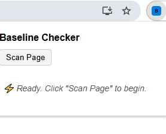
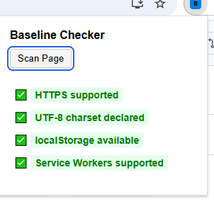

# 🔎 Baseline Checker Extension

A simple Chrome extension that checks if a webpage supports essential **baseline web features** such as HTTPS, UTF-8 encoding, localStorage, and more.  
Built for the Chrome contest as a lightweight developer tool.

---

## 🚀 Features

- ✅ Detects if the site is served over **HTTPS**  
- ✅ Checks if the page declares **UTF-8 encoding**  
- ✅ Tests for **localStorage availability**  
- ✅ Shows results with clear **green (✔️) / red (❌)** indicators  
- ✅ Works instantly with one click from the popup  

---

## 📂 Project Structure

baseline-checker-extension/ ├── manifest.json         # Extension manifest (v3) ├── popup.html            # Popup interface ├── popup.js              # Logic for popup display ├── popup.css             # Styling for popup ├── content.js            # Injected script to check baseline features ├── background.js         # Handles extension background tasks ├── baseline-data.js      # (Optional) Shared helpers / constants ├── screenshot1.png       # Popup before scanning ├── screenshot2.png       # Popup after scanning ├── README.md             # Project documentation └── LICENSE               # MIT License

---

## 🖼️ Screenshots

### Popup Before Scan


### Popup After Scan


---

## 📹 Demo Video

👉 A full demo video will be uploaded soon on **YouTube**.  
📌 *[Placeholder for YouTube link — will update later]*

---

## 🛠️ Installation (for testing)

### Method 1 – Clone with Git
```bash
git clone https://github.com/humaira-fatima898/baseline-checker-extension.git

Method 2 – Beginner Friendly (ZIP Download)

1. Go to your GitHub repo page.


2. Click the green Code button → Download ZIP.


3. Extract the ZIP file on your computer.


Load into Chrome

1. Open Chrome and go to:

chrome://extensions/


2. Enable Developer mode (top right toggle).


3. Click Load unpacked.


4. Select the baseline-checker-extension folder.


5. The extension will now appear in your toolbar 🎉


---

📋 Usage

1. Navigate to any website (e.g., Wikipedia).


2. Click the Baseline Checker icon in your Chrome toolbar.


3. See instant results in the popup.


✔️ Green = supported
❌ Red = not supported


---

📊 Example Test Cases

✅ All OK: https://developer.mozilla.org/

⚠️ Partial OK: http://example.org/


---

📄 License

This project is licensed under the MIT License © 2025 Humaira Fatima.


---

🙌 Acknowledgements

Built with Manifest V3 APIs.

Inspired by the Chrome Baseline concept.

Thanks to contest organizers for the opportunity!
